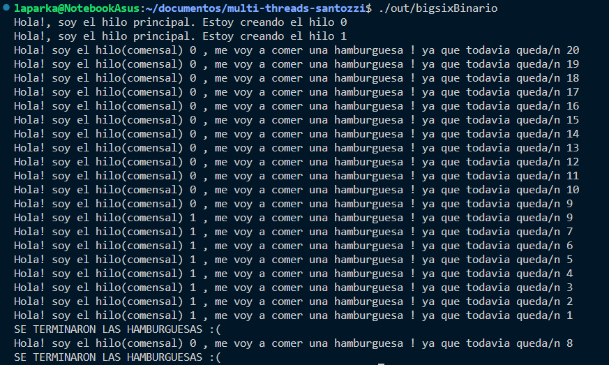
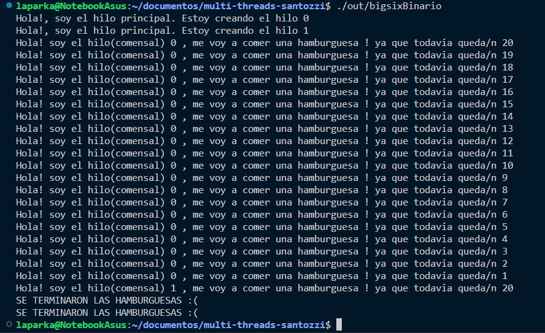
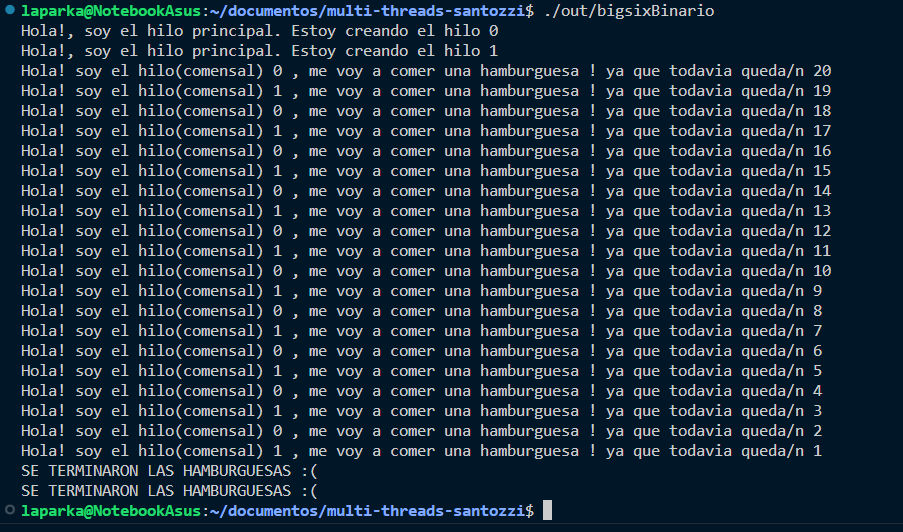

# Práctico 2a - Problema de BigSix
### Problema
Tenemos un programa que simula ser un “Big Six”
- Cada hilo de ejecución representaría un comensal (para simplificar solo tendremos 2 comensales)
- Los comensales son dos hermanos que se caracterizan por ser muy educados y comparten todo de
manera muy equitativa, por lo que deberían ir comiendo alternadamente por turnos de a una
hamburguesa cada uno
- Al finalizar las hamburguesas cada hermano debería haber comido la misma cantidad de
hamburguesas cada uno
- Un programador despistado (no vamos a decir quién) implementó un algoritmo que intenta modelar lo
enunciado anteriormente
- El código bigsix-con-hilos.c no estaría funcionando bien y eventualmente presenta fallas

Cada uno de los hilos consume la región crítica, sin ningún orden. A este problema se lo conoce como RACE CONDITION. 
### Screenshot del problema

### Solución para N hilos
En el archivo busy_waiting.c se soluciona el problema aplicando un algoritmo de exclusión mutua llamado Busy Waiting.

### Screenshot de la solución

#### Integrantes
<ul>
   <li>Sergio Antozzi</li>
   <li>Jessica Escobar</li>
   <li>Aldana Aranda</li>
</ul>

