# Práctico 2b para Arquitectura y Sistemas Operativos UTN

* 1. Capturas sin hilos

procesador intel core i5 10°generación
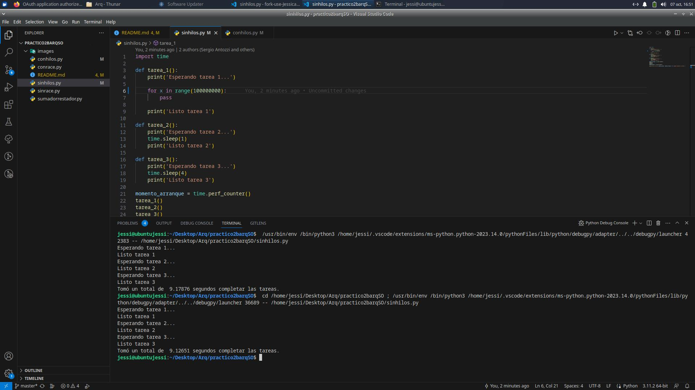

 
procesador intel core i7 11° generación
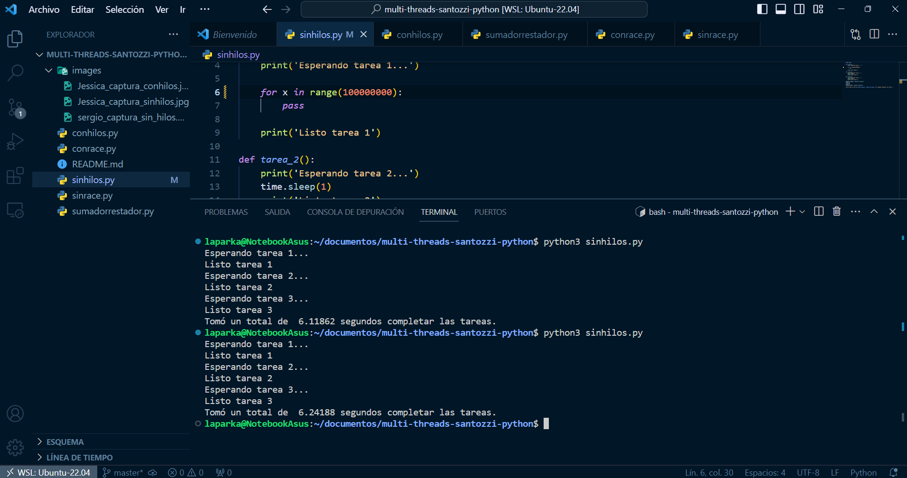

 
procesador intel core i3 4°generación
 
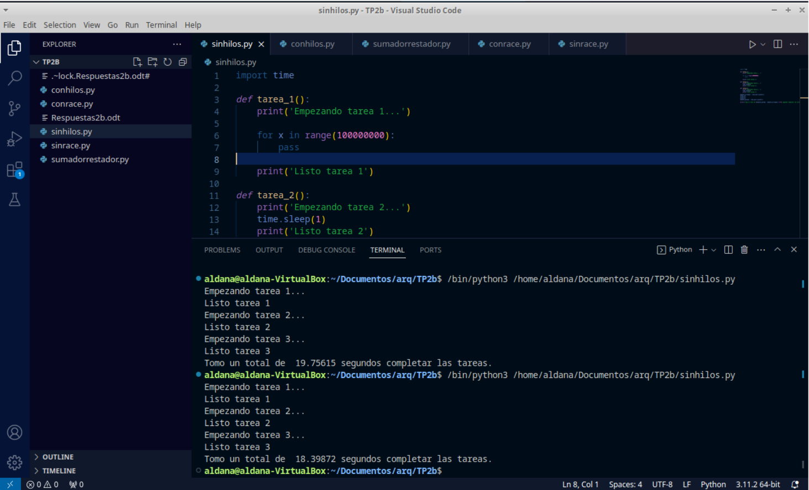

 

* 1a) El tiempo de ejecución en la tarea 1 depende del procesador de la máquina donde se ejecute. Sin embargo, la tarea 2 y 3 tienen una demora fija indistintamente de la máquina donde se ejecute. Las tareas son secuenciales ya que trabajan con un solo hilo. En conclusión, al no saber el tiempo exacto que se demora la primer tarea no podemos saber cual va a ser el tiempo resultante. No obstante si volvemos a ejecutarlo podríamos decir que el tiempo es predecible ya que va a arrojar un resultado igual o muy parecido al anterior.

* 1b) La velocidad de compresión y descompresión está directamente relacionada con la
capacidad de procesamiento de la máquina. Cuanto más rápida sea la máquina, más rápido
se completará el proceso. En este caso, la velocidad de la máquina es un factor crítico y
determina la velocidad máxima posible de compresión y descompresión.

* 1c) Cuando se descargan archivos desde internet, la velocidad de descarga puede variar
dependiendo de varios factores, como la velocidad de la conexión a internet, la congestión de
la red o la capacidad del servidor desde el cual se está descargando el archivo. Esto significa
que el tiempo que lleva completar la descarga puede ser impredecible y no necesariamente
depende de la velocidad de procesamiento de la computadora.

* 2. Capturas con hilos

procesador intel core i5 10°generación

 
procesador intel core i7 11° generación
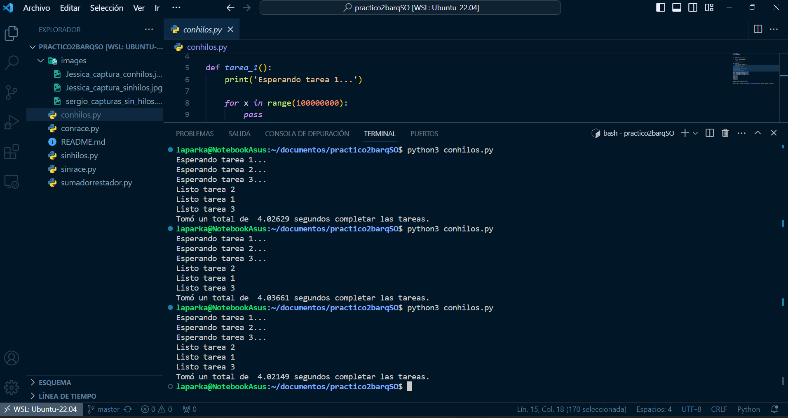

 
procesador intel core i3 4°generación
 
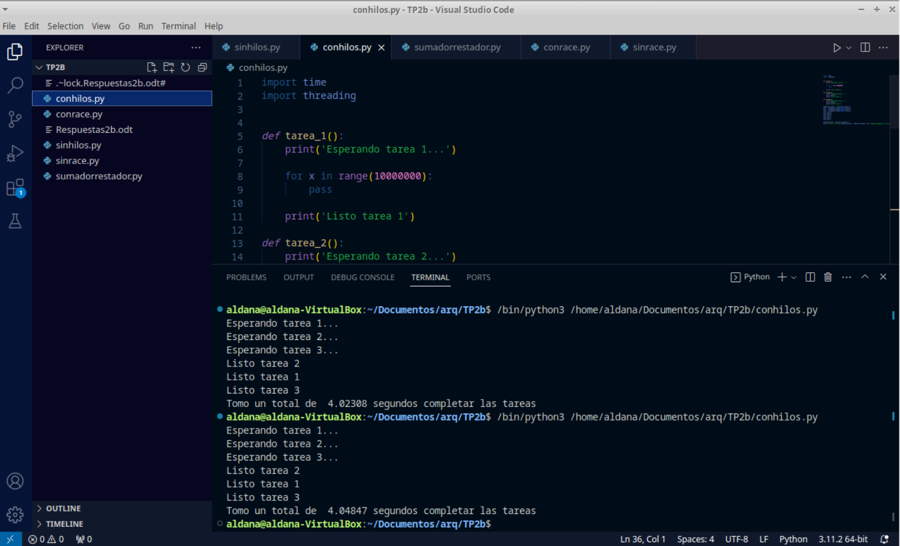

 

* 2a) Al ejecutarse los procesos en paralelo el tiempo de ejecución va a ser similar al proceso que tarde más. El tiempo de respuesta con respecto al mismo programa sin hilos mejoró.
* 2b) Las funciones no completan su ejecución en el orden establecido
* 2c) En un videojuego moderno, el uso del multihilado es fundamental para mejorar el
rendimiento del renderizado de gráficos. El renderizado de gráficos requiere una gran
cantidad de recursos computacionales y es esencial para lograr una experiencia visual
inmersiva y fluida en tiempo real.
El multihilado permite dividir la carga de trabajo del renderizado en varios hilos, lo que
permite realizar múltiples tareas en paralelo. Por ejemplo, se pueden asignar hilos separados
para el procesamiento de físicas, la generación de sombras, la iluminación y otros efectos
visuales. Cada hilo se encarga de calcular y actualizar una parte específica de la escena del
juego.
De esta manera, al utilizar el multihilado, se puede aprovechar al máximo la capacidad de
procesamiento de la CPU y acelerar el tiempo de respuesta del sistema. Esto se traduce en
una mayor fluidez en la animación y una mejor respuesta a las interacciones del jugador, lo
que mejora significativamente la experiencia de juego en general.

* 3 Capturas sumador restador

procesador intel core i5 10°generación
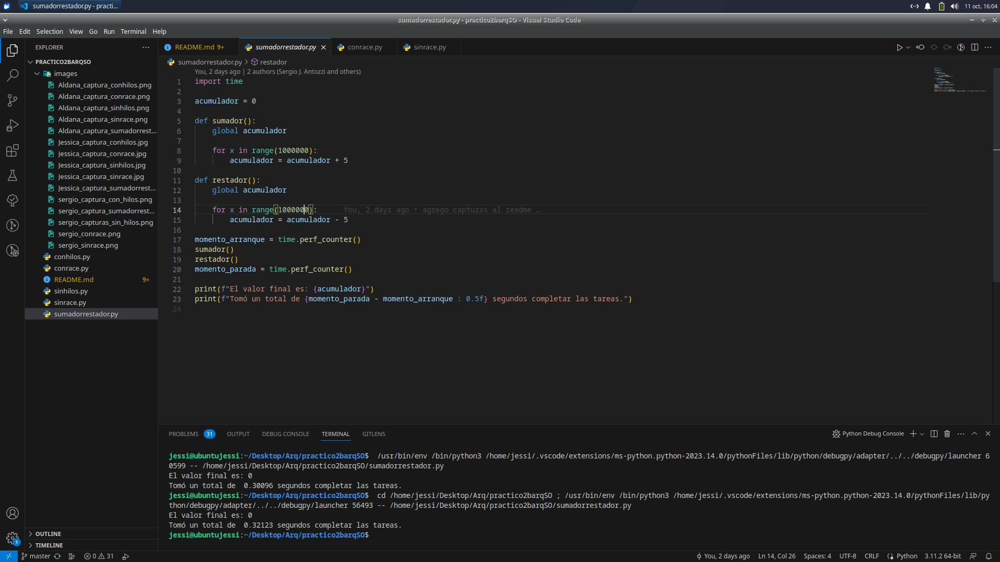

 
procesador intel core i7 11° generación
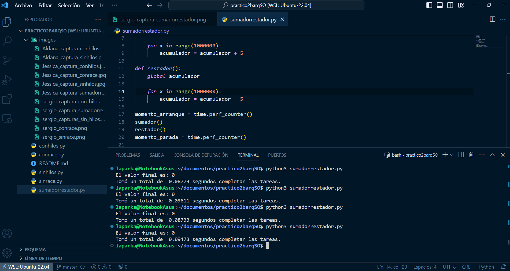

 
procesador intel core i3 4°generación
 
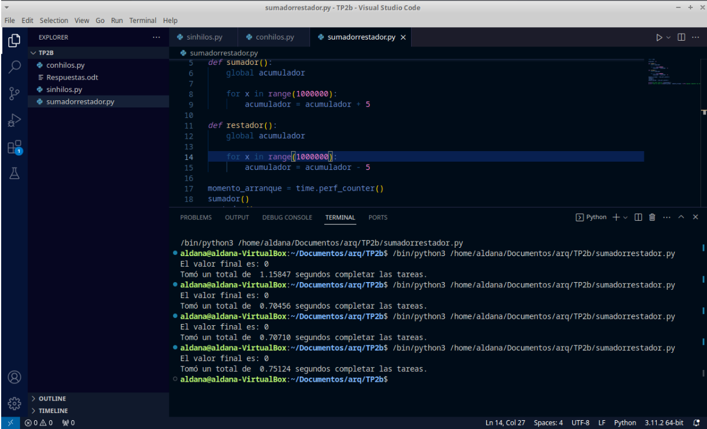

 

* 4 Capturas con race

procesador intel core i5 10°generación
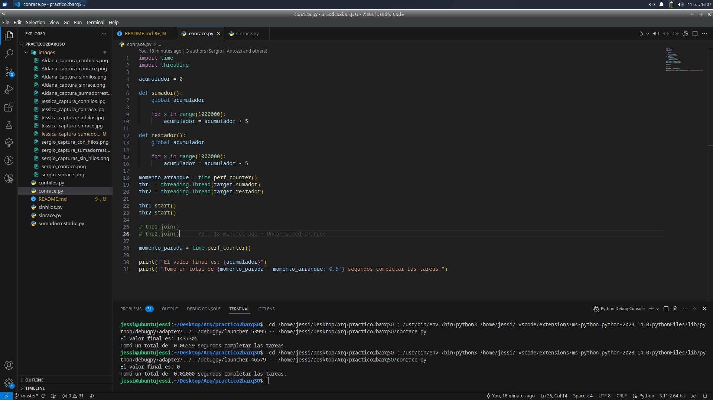

 
procesador intel core i7 11° generación
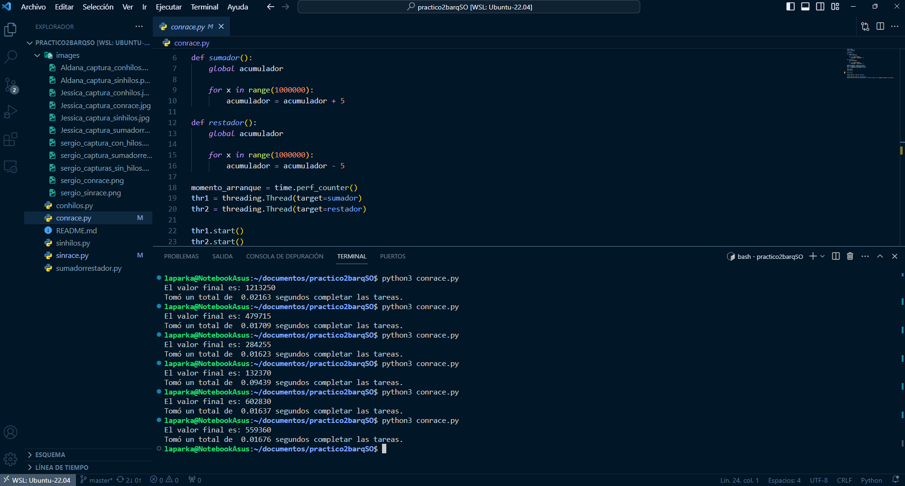

 

* 4.a)Al observar el resultado impreso, se puede notar que el tiempo de ejecución total es
menor. Esto se debe a que los hilos permiten que las operaciones se realicen de manera
simultánea, aprovechando los recursos de la máquina para ejecutar tareas en paralelo.

* 4.b)No se puede predecir el valor final del acumulador.

* 4.c)Sucede esto por el race condition porque los hilos entran a la zona crítica en forma desordenada e impredecible.

* 4.d)Esta condición de carrera sin dejar de usar hilos se puede corregir usando algún algoritmo tipo semáforo, en python podemos usar el ".join()" para que cuando se termine de ejecutar uno, comience la siguiente línea. 

* 5 Capturas sin race

procesador intel core i5 10°generación
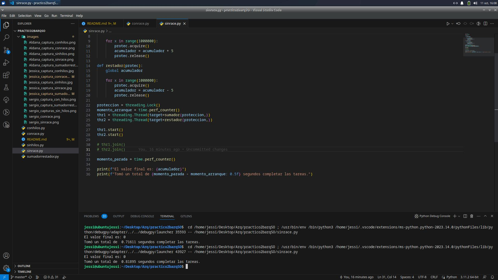

 
procesador intel core i7 11° generación
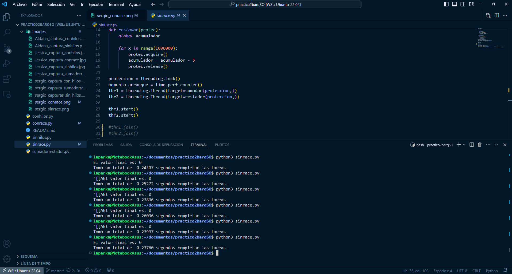

 

* 5.a)El acumulador siempre da 0 ya que suma y resta 5 la misma cantidad de veces, esto se debe por el método acquire que se utiliza para adquirir o tomar posesión de un recurso compartido, como un semáforo, en un entorno concurrente.
* 5.b) Con respecto al algoritmo sin hilos el tiempo es menor, ya que usa hilos en paralelo.